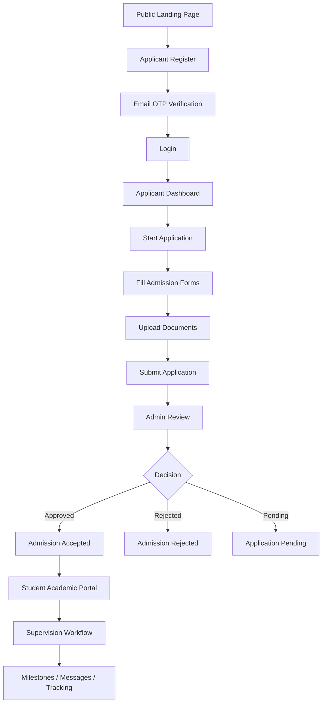
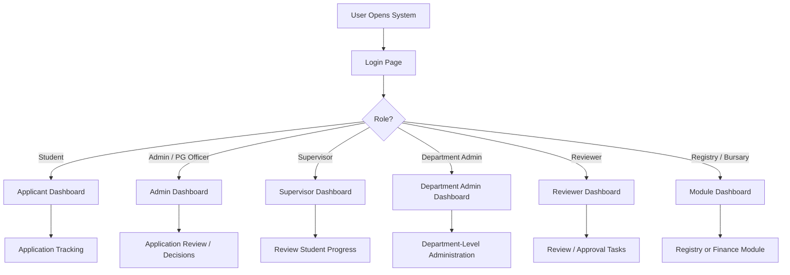

# JOSTUM System Flowchart

This document summarizes the main system flow based on the current workspace structure and key entry files.

## 1. High-Level Applicant Journey

## 2. Role-Based Access Flow

## 3. Main Modules Present in the Workspace

- Public admissions portal: [index.php](index.php), [APPLICANT/ADMISSIONS/index.php](APPLICANT/ADMISSIONS/index.php)
- Applicant authentication: [APPLICANT/ADMISSIONS/login.php](APPLICANT/ADMISSIONS/login.php), [APPLICANT/ADMISSIONS/register.php](APPLICANT/ADMISSIONS/register.php)
- Core shared auth and routing: [app/bootstrap.php](app/bootstrap.php), [app/helpers/auth.php](app/helpers/auth.php)
- Admin area: [ADMIN](ADMIN)
- Academic/student workflow: [APPLICANT/ACADEMICS](APPLICANT/ACADEMICS)
- Additional modules: [modules](modules)

## 4. Suggested Flowchart Interpretation

The current workspace is structured around these business processes:

1. Public application intake
2. Registration and authentication
3. Admission form submission and document upload
4. Admin review and decision making
5. Student portal access after admission
6. Supervision, milestones, messages, and tracking

If you want, the next step can be to convert this into a more detailed draw.io or Visio-style flowchart with decision points and database actions.
