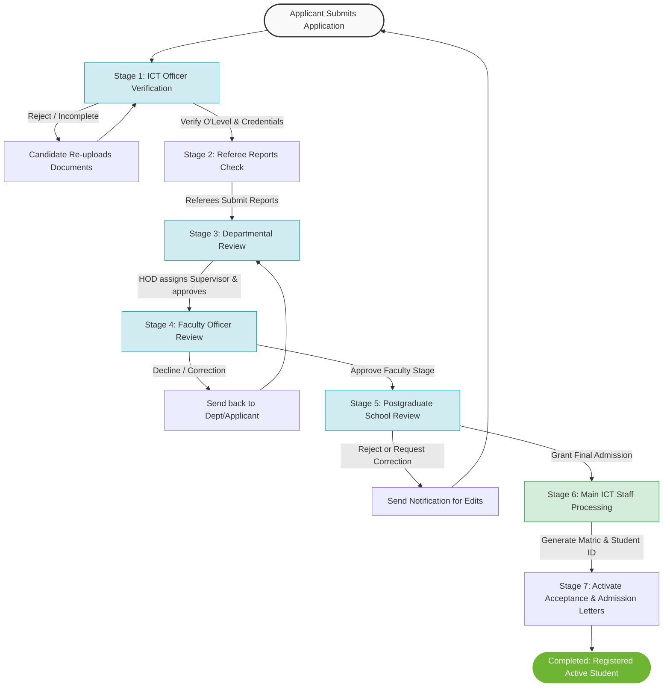
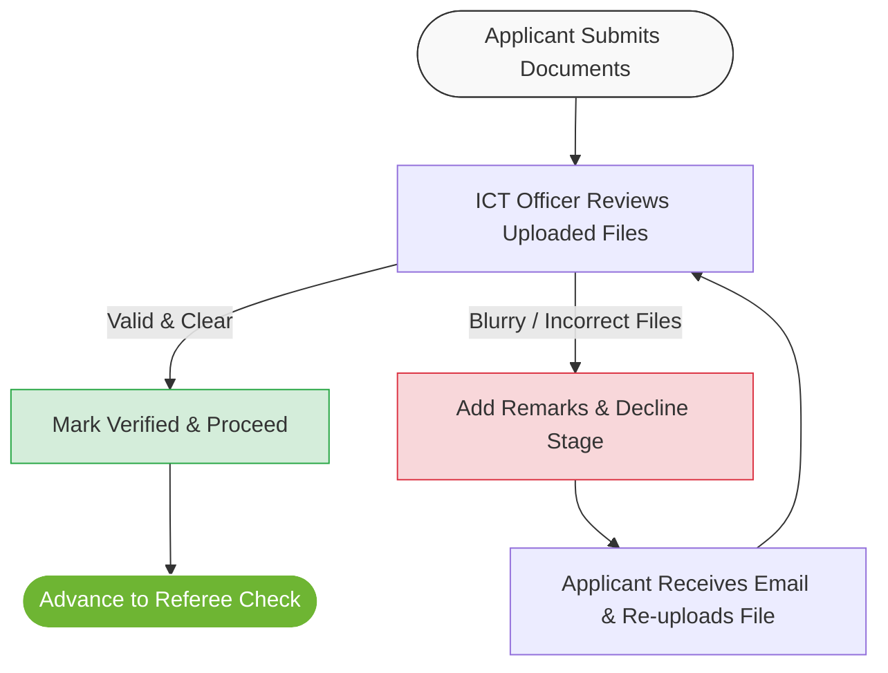
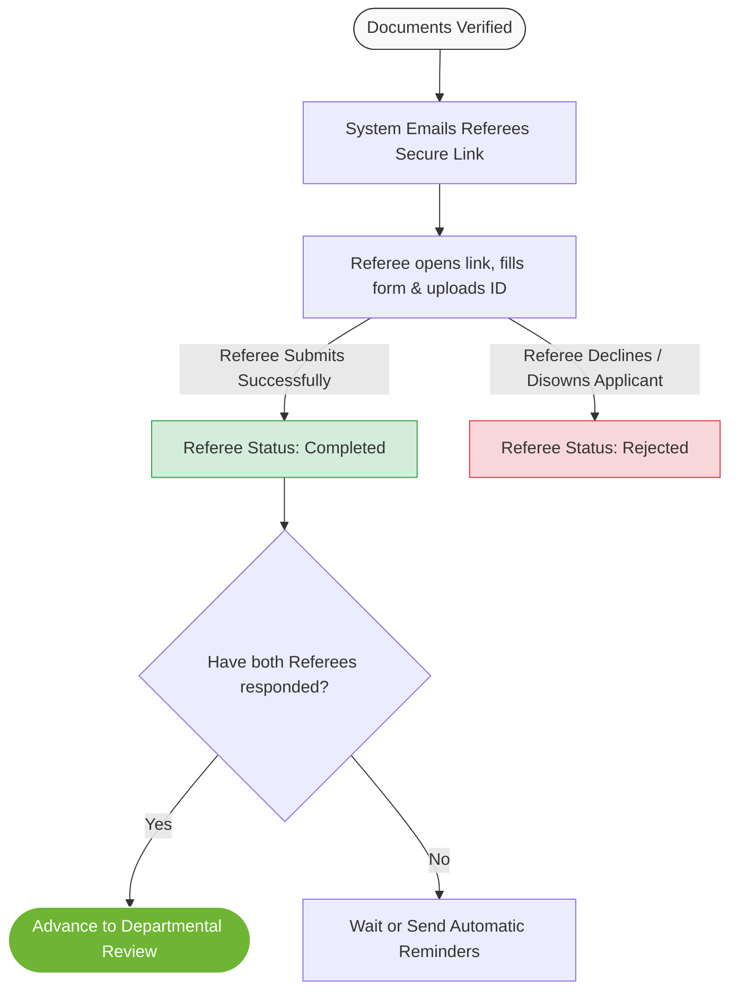
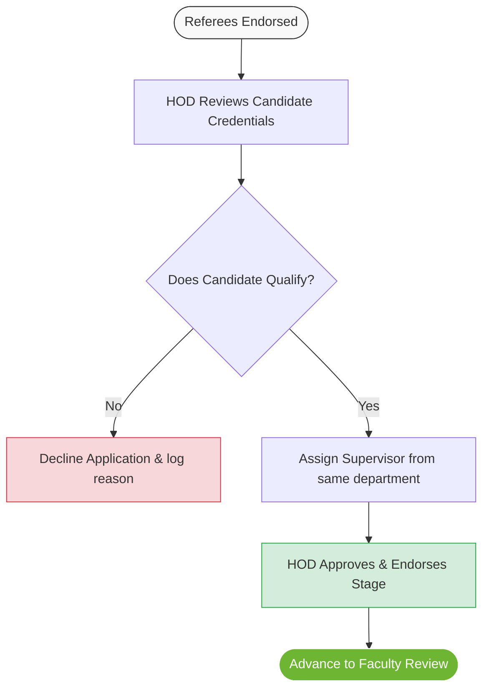
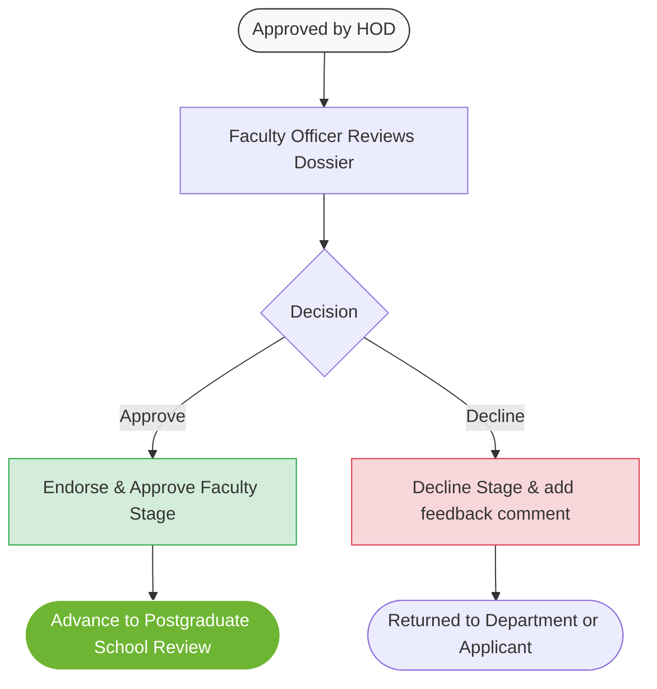
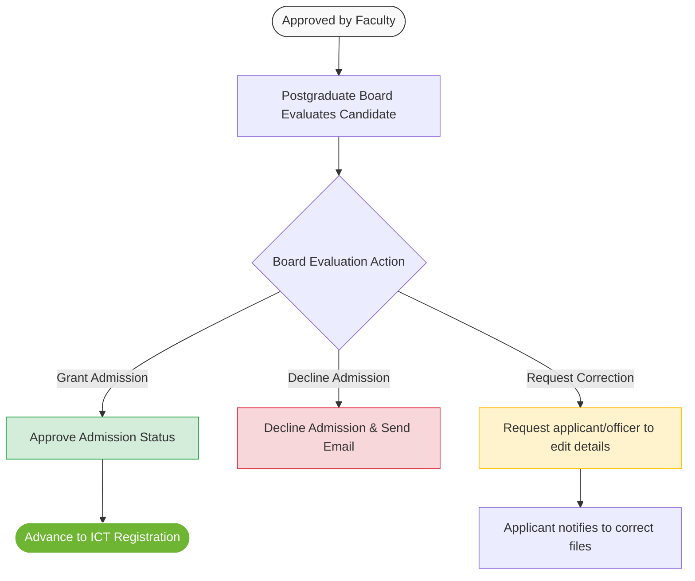
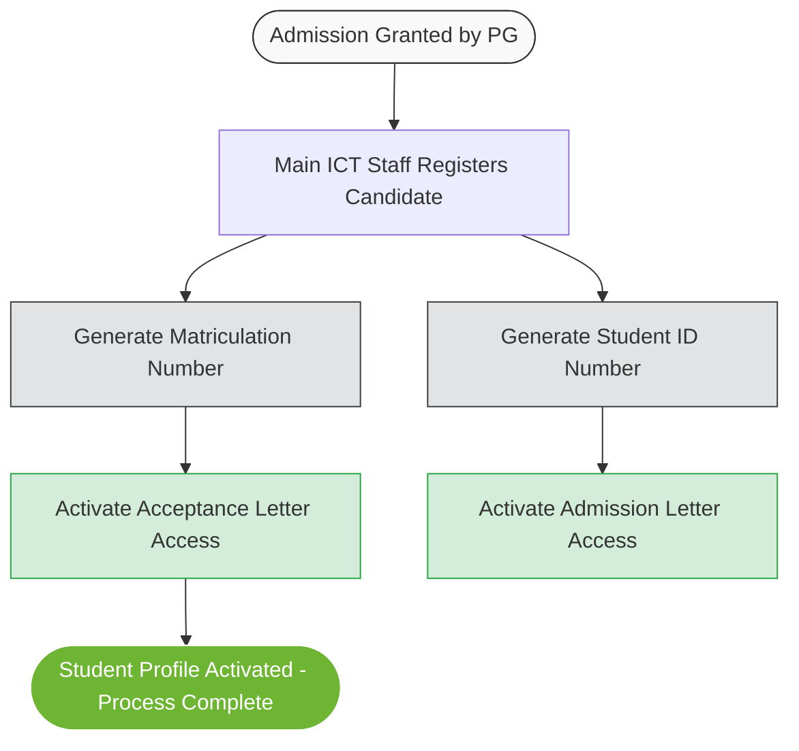

# IPESS Admission & Registration Workflow Flowcharts

This document details the admissions and registration workflows of the IPESS portal. To make it easy for non-technical stakeholders (such as administrators, board members, and officers) to understand, we have broken down the system into an overall diagram followed by step-by-step descriptions for each individual phase.

---

## 1. Overall System Workflow (The Big Picture)

This flowchart shows how an application progresses from initial submission to the final stage of becoming an active student. Each block represents an approval gate that must be completed in order.

---

## 2. Separate Phase-by-Phase Flowcharts

Below are detailed flowcharts for each individual phase, written in plain language.

### Phase 1: ICT Officer (ICTO) Document Verification
**What happens here in plain language:**  
The ICT Officer checks if the applicant's uploaded documents (like O'Level results, certificates, and passports) are clear, readable, and genuine. If everything looks good, the applicant moves forward. If something is blurry or incorrect, they are sent an email asking them to re-upload.

---

### Phase 2: Referee Report Verification
**What happens here in plain language:**  
The system automatically sends a secure link to the two referees chosen by the applicant. Referees must click the link, fill out a quick form, and upload their ID cards/passports to confirm they know the candidate.

---

### Phase 3: Departmental Review (Head of Department / HOD)
**What happens here in plain language:**  
The Head of Department (HOD) reviews the candidate's academic qualification history to check if they qualify for the chosen course. Before they can approve the application, they must assign an academic Supervisor from their own department.

---

### Phase 4: Faculty Officer Review
**What happens here in plain language:**  
The Faculty Officer performs an administrative check to ensure the application conforms to general faculty policies and rules before sending it to the PG School for the final decision.

---

### Phase 5: Postgraduate School (PG School) Board Review
**What happens here in plain language:**  
This is the final academic approval gate. The PG School Board reviews the application, including the reviews of the HOD and Faculty Officer. The board can grant final admission, reject the application, or send it back to the candidate/officers to correct information.

---

### Phase 6: Main ICT Staff Processing
**What happens here in plain language:**  
Once the PG Board approves admission, the Main ICT team officially registers the candidate. They generate their unique Matriculation Number and Student ID, and activate their Acceptance and Admission Letters so the student can print them and complete their enrollment.

